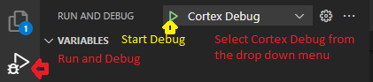
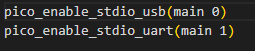
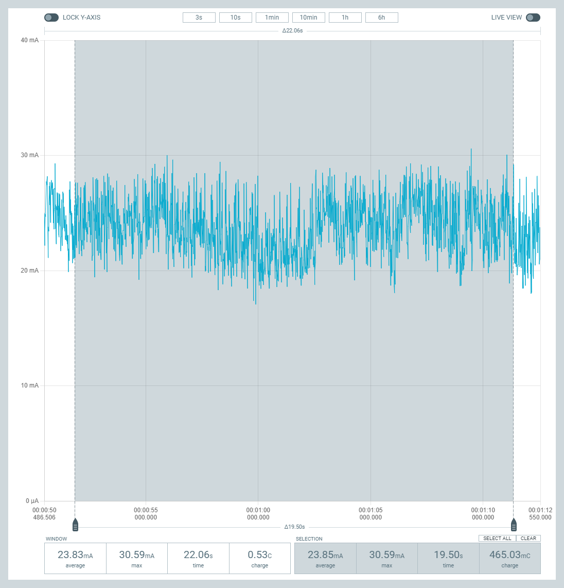
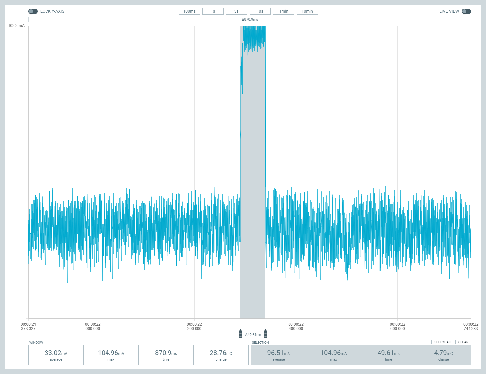
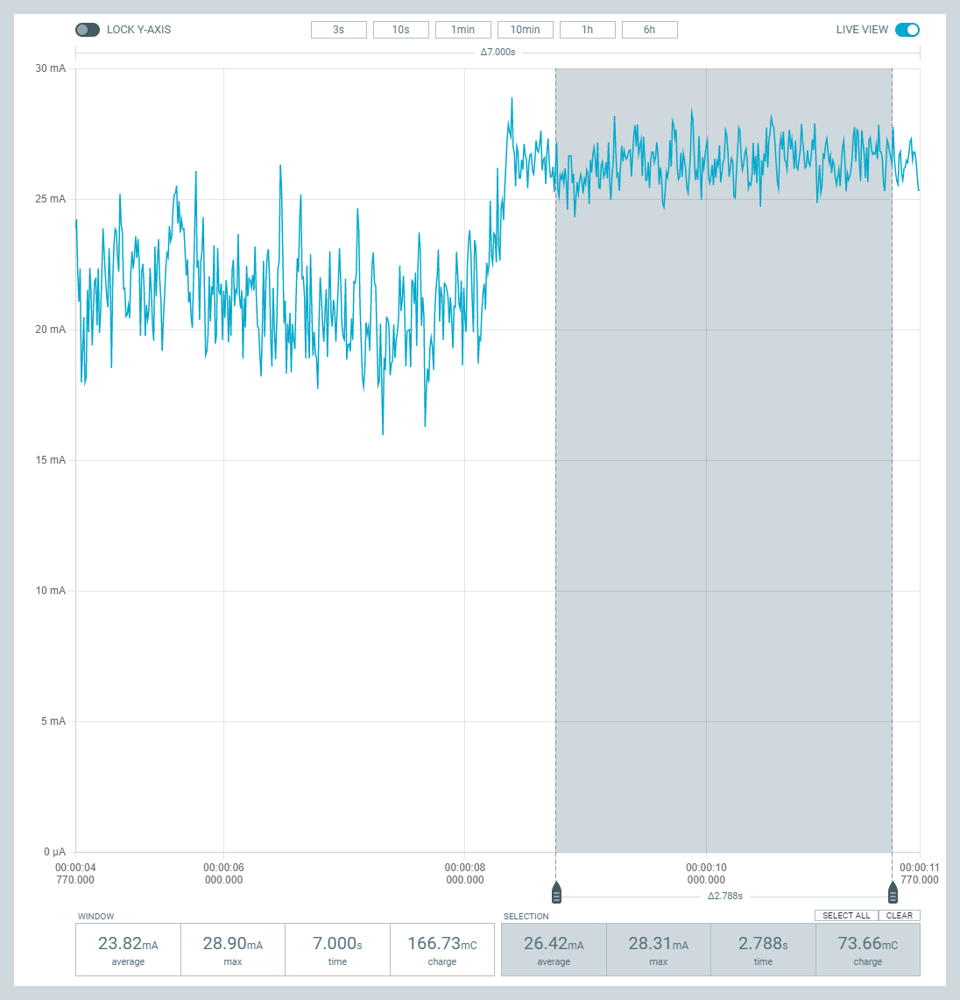

# RFID Unlocker
Charlie Dauchess  
MES Yellow Seahorses

## Application Description
This system provides a method to control access to a small electric vehicle through an RFID keytag.  The system will be primarily be powered by the vehicles 12V system, and turned on when the rest of the vehicle is powered up.  It will disable vehicle motion by default upon power up.  The RFID keytag allows the system to identify if an authorized user is attempting to enable the vehicle.  An LED is used to indicate the system status to the user.  After a period of inactivity the system will disable the vehicle.

## Hardware Description

I'm using the Raspberry Pi PICO development board for this project.  This has a Raspberry Pi RP2040 microcontroller, a dual-core Arm Cortex M0+ processor. 

- [RP PICO](https://www.raspberrypi.com/products/raspberry-pi-pico/)
    - Dual core Arm Cortex M0+
    - Development board that includes flash storage and power supply.
- RFID: [MFRC522](https://www.amazon.com/SunFounder-Mifare-Reader-Arduino-Raspberry/dp/B07KGBJ9VG) : SPI
    - RFID used to identify authorized users
- [Latching Relay](https://www.digikey.com/en/products/detail/omron-electronics-inc-emc-div/G6BK-1114P-US-DC5/369134) : GPIO
- [WS2812B](https://www.adafruit.com/product/2761) LED
    - Fun with colors!
    - Indicates system status
        - Red: Vehicle Off
        - Green: Vehicle On
        - Blue: Console Mode
        - White: Invalid card 
- 12V to 5V [DC-DC Converter](https://www.digikey.com/en/products/detail/mornsun-america-llc/VRB1205S-6WR3/16348304)
    - Accepting 12V external power
- [ADXL343](https://www.analog.com/media/en/technical-documentation/data-sheets/ADXL343.pdf) Accelerometer : I2C
    - This may be a point for future improvement by adding a gyro/magnetometer for better inactivity detection
- [Button](https://www.digikey.com/en/products/detail/cui-devices/TS02-66-73-BK-160-SCR-D/15634261) for user interface : GPIO with interrupt
- [CAT24C32](https://www.onsemi.com/pdf/datasheet/cat24c32-d.pdf) EEPROM : I2C

### Hardware Diagram:

## Software Description

This project is built on the RP2040 SDK.

Upon wakeup the system initializes and reads the authorized user data base from the onboard EEPROM. After reading the user database the system enters the infinite while loop where the accelerometer is read every 50 ms, the button is debounced if it is pressed, and the main state machine operates.  By default the system enters the state machine in the "vehicle off" state after a power cycle.

- Vehicle Off - LED is red
    - If a card is presented to the RFID reader the system switches to "card presented"
    - If the button is pressed the system switches to "console mode"
- Card Presented - The card is compared against the user data base to determine if the user is authorized
    - User Authorized: The system closes the relay, flashes the LED green followed by a steady green, and switches to "vehicle on"
    - User Not Authorized: The system turns the LED white, returns to "vehicle off"
- Vehicle On:
    - If the button is pressed, or the vehicle is considered inactive the system goes to the "shutdown" state
- Shutdown: Open the relay, set the LED to red, go to "vehicle off"
- Console: Operate the console as decribed in the console section below.
    - If the button is pressed or exit command issued, return to "vehicle off"

The vehicle inactivity is determined by comparing the average acceleration on each axis for the past 5 seconds (sampled every 50 ms) to the current acceleration values.  If the difference on all 3 axes is below a tolerance (currently 50mG) the vehicle is determined to be inactive.  This needs to be calibrated on a vehicle, and likely extended to a longer time duration to prevent inactivity triggers for a short stop.

See [here](/Documents/EEPROM%20Map.xlsx) for the memory map in the EEPROM.  The first byte contains the total number of users stored, and each user UID is 4 bytes long.  I have currently provisioned for 256 users, but I can rearrange should the unlikely scenario of more users required appear in the future.

### RP2040 SDK
I worked with version 1.4.0 of the SDK.

All of my interactions with the harware were through the RP2040 SDK.  This made it easy to do simple things such as control GPIO as well as more complicated things such as set alarms.

The SDK can be found [here](https://github.com/raspberrypi/pico-sdk)

The license can be found [here](https://github.com/raspberrypi/pico-sdk/blob/master/LICENSE.TXT)

### ADXL343

I wrote the driver in my system for the ADXL343.  I kept this one fairly simple as my goal was just a simple intiialization and then a function to read the current acceleration values. I didn't need anything too fast as I wasn't trying to determine an accurate position with the accelerometer.  There would be some intial challenges with expanding the library to using some other features of the accelerometer (such as tap detection), but it wouldn't be too difficult to add that functionality if required.

### CAT24C32

I wrote the driver for the EEPROM used in my system, the CAT24C32.  The library contains base functions for single byte and page writes and reads.  The page write and read are different because the CAT24C32 has a 32 byte write limit per transaction whereas there is no read limit per transaction(well the real limit would be the size of the EEPROM...).

### Relay

I used a latching relay for this project which requires different close and open functions.  This module contains functions to intialize the GPIO pins used for the relay, open, and close the relay.  This module also uses the alarm function from the RP2040 SDK to hold the specified GPIO pin high for only the short period of time that is required to switch the relay state.

### MFRC522
Borrowed arduino library from [here](https://github.com/miguelbalboa/rfid), version 1.4.10.  I did some modifications and removed unused functions to make the library compatible with the RP2040 SDK.  I also wrote an adapter layer (MFRC522_RP2040) to adapt the arduino functions to the RP2040 SDK.

The license can be found [here](https://github.com/miguelbalboa/rfid/blob/master/UNLICENSE)

### Console
I borrowed the console from Elecia White's Wokwi demo [here](https://wokwi.com/projects/324879108372693587).  I removed un-used commands and added the commands specific to my application.

License information is [here](https://github.com/eleciawhite/reusable/blob/master/LICENSE)

The console has 5 commands:
1. help: This command lists all of the available commands with a short description
2. ver: This command displays the system version
3. users: This displays a list of the authorized users
4. accel: This shows the raw accelerometer values at the moment the command is sent on all three axes (x,y,z) in milli-g.
5. exit: This command exits the console and returns the system to normal operation

### Neopixel
Borrowed from RP2040 Examples.  The original code can be found [here](https://github.com/raspberrypi/pico-examples/tree/master/pio/ws2812)

The license for this code is the [3-Clause BSD](https://opensource.org/licenses/BSD-3-Clause) license

This code makes use of the PIO state machines on the RP2040 to PWM an output pin and shift out a buffer of data containing the pixel information.  I took the functions that I needed (init, put_pixel, and urgb32) and put them in their own file for organization's sake.  I had to modify the function responsible for formatting the bitstream based on the desired colors (urgb32) to add in white because I was using a RGBW led.

### Diagrams

Software Diagream:

Hierarchy of Control:

## Build Instructions

### Hardware:
Below is the system schematic for the system

The only device external to the PCB required is a MFRC522 module.  These can be found in many places online, one example is [here](https://www.amazon.com/SunFounder-Mifare-Reader-Arduino-Raspberry/dp/B07KGBJ9VG) on Amazon.  All of the connectors are [Molex Microfit 3.0](https://www.molex.com/molex/products/family/microfit_30).  A "Picoprobe" was used for debugging.  This is another RP Pico that is flashed with the picoprobe firmware to act as a debugger.  This also allows for pass through serial data back to the PC.

Here is a photo of the finished part with some addtional wiring for a output status LED to aid in demonstration: 

### Software
1. Install OpenOCD with picoprobe, according to the steps in [Getting Started](https://datasheets.raspberrypi.org/pico/getting-started-with-pico.pdf), Appendix A
2. Follow the steps [here](https://shawnhymel.com/2096/how-to-set-up-raspberry-pi-pico-c-c-toolchain-on-windows-with-vs-code/) to install GCC, Cmake, Python, VScode.  These steps also download the RP2040 SDK and configure  your system.
3. The following VS code extensions simplify the build and debug process: CMake, CMake Tools, and Cortex-Debug
4. Install the picoprobe uf2 to one Pico, and connect it the system with the correct wiring (See the table below).

| Picoprobe | RFID Unlocker |
| :--:      | :--:          |
|   GND     | Debug 2       |
|   VSYS    | Debug 1       |
|   GP2     | Debug 3       |
|   GP3     | Debug 4       |
|   GP4     | Debug 6       |
|   GP5     | Debug 5       |

Within VS Code you will need to select your compiler (I used GCC 10.3.1), and then press build.

Once the project is built you can flash and begin the debug process by opening the "Run and Debug" tab, selecting "Cortex Debug" from the drop down menu, and pressing "Start Debugging" or F5.

 
This will put you into the debug mode where you can pause/run the system, view variables, etc.

In order to access the console over the onboard USB rather than the picoprobe you need to enable the stdio over USB.  This can be done by replacing the 0 for a 1 in the CMakeLists.txt file line "pico_enable_stdio_usb(main 0)".  The uart stdio should also be disabled by replacing the 1 with a 0 on the line "pico_enable_stdio_uart(main 0)".  Rebuild and reflash the target after doing this to have access to the console over the onboard USB connector.

## Power Analysis

This will be battery powered, albeit by a big battery, so power analysis would be useful to understand the impact on battery life will be however small it is.  In an application where it does not receive power from the main vehicle battery it should be able to have enough energy to operate for a complete day.

### Initial Design
Below is a table of the two main power modes in the system.  It is expected that the RFID read will take significantly more power, but this will be a very short duration.  This table is populated with worst case data sheet values to account for edge cases.

|Device  |	RFID Read (mA)	|Vehicle On (mA)|
|  ---| ---| ---|
|RP PICO	|10|	10|
|ADXL343	|0.0001|	0.03|
|MFRC522	|100	|6.5|
|RGB LED	|12.25|	12.25|
|CAT24C32	|2	|0.005|				
|Total	    |124.2501	|28.785|

### Testing
The "Vehicle On" current as measured can be seen in the following image as being 23.8mA on average:

Something I didn't consider too closely in my intial analysis was the system current during the relay actuation because the duration was so short.  Once measured I found that the current was on average 96.5mA during the 50mS relay actuation as seen in the image below:

The curent during a RFID read was the surprise.  The current had a relationship to the card distance - higher current the closer the card was to the reader.  However, even with the card resting on the reader I found it to only add ~2mA to the system current draw.

### Conclusions
Overall the system was close to the expected current draw, however a bit under.  Some of this could be explained by the colder temperatures during testing as I chose all of my initial design values from the worst case (usually hot ambient) numbers in the data sheets.

Due to the latching relay and the 5 second minimum on time that I have to prevent rapid switching the relay actuation would add at most an average 2mA draw to the system (100mA draw, 2 50mS actuations every 5 seconds).  As a result it can be assumed the worst case average current draw would be ~28mA.  A 2200 mAh 18650 like the one [here](https://www.adafruit.com/product/1781) would be capable of power the system for 78 hours, plenty for a single days use, satisfying my initial requirement of a single days operation.

All of the measurements were performed on the 5V supply to the system, resulting in the average power being 0.14W

In the primary target application which would have 5kWh of energy on board and an average power draw around 500W an additional 0.14W would be at the noise level of additional loads on the system.

## Future

Time constraints led me to modify my initial plan of having a modifiable authorized user list.  In the future I plan on adding a command in the console that has a process for adding and removing users. 

I'd like to improve my method of determining inactivity.  The current method may prove to be challenging to scale to larger timeout times due to the large amount of memory required.  I may have to periodically average the entire sample set to reduce the required memory.  

A sleep method while waiting for an RFID tag to be presented could be implemented to reduce the power consumption in the event that the device needs to be powered by a small battery.

The addition of a CAN transceiver and controller would be a nice alternate method to enabling/disabling a vehicle.  This would make the system more universal for vehicles and the integration/wiring into the vehicle simpler due to not requiring a wire to break that disables the vehicle drive.

## Self Assesment
| Criteria  | Score   |  Comments  |
|---|---|---|
| Project meets minimum requirements  | 2.5  | I had 1 more peripheral than required (however 2 of them communicated over I2C).  However I didn't go too far beyond the minimum requirements.  |
| Completeness of deliverables  | 2.5  | I went into depth on all the parts of my system as well as sucessfully demonstrated it in live class.  |
| Clear intentions and working code  | 2  | The system works, but I feel like I could have done a better job documenting my code for future users.  |
| Reuisng code  |  2 | I identified where external code came from and the licenses that came with each set.  Some of my modifications got mixed in.  |
| Originality and scope of goals  | 2  | This system was fairly basic, but I felt that I learned a lot in the process of building this system  |
| Bonus: power analysis  | 3  | Power analysis was performed even though the system is not intended to be powered by a small battery.  It is still good to understand the impact of this small of a system on a much larger battery  |
| Bonus: version control used  |  3 | I used Git throughout the project.  I focused on using branches for each peripheral that I added.  |

